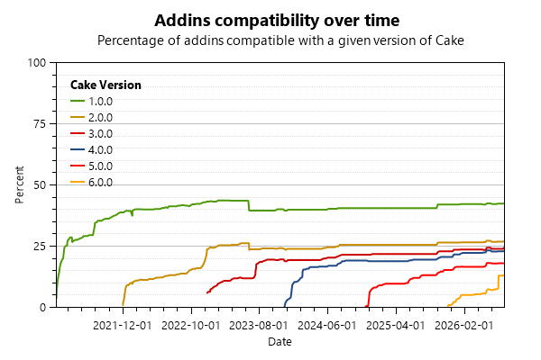

# Audit Report

This report was generated by Cake.AddinDiscoverer 5.25.2 on Friday, July 24, 2026 at 12:04:31 PM GMT

## Overall statistics

- The analysis discovered 381 distinct nuget packages.
- If you count all the versions of these addins, there's a grand total of 5537 packages on NuGet.org

## Statistics

- Of the 381 audited nuget packages:
  - 306 are addins
  - 11 are modules
  - 20 are recipes
  - 20 are marked as deprecated
  - 24 could not be audited (see the 'Exceptions' section)
- Of the 337 successfully analyzed packages:
  - 27 are using the cake-contrib icon on the rawgit CDN (which has been shutdown since October 2019)
  - 92 are using the cake-contrib icon on the jsDelivr CDN (which was our preferred CDN to replace rawgit)
  - 51 are using a custom icon hosted on a web site
  - 21 are embedding the cake-contrib icon (which is the current recommendation)
  - 97 are embedding one of the "fancy" cake-contrib icons (which is also recommended)
  - 12 are embedding a custom icon
  - 188 have been transferred to the cake-contrib organization
  - 227 have replaced the obsolete `licenseUrl` with proper license metadata (see the `Additional audit results` section below for details)

## Reports

- Click [here](Audit_for_recipes.md) to view the report for NuGet packages containing recipes.
- Click [here](Audit_for_Cake_1.0.0.md) to view the report for Cake 1.0.0.
- Click [here](Audit_for_Cake_2.0.0.md) to view the report for Cake 2.0.0.
- Click [here](Audit_for_Cake_3.0.0.md) to view the report for Cake 3.0.0.
- Click [here](Audit_for_Cake_4.0.0.md) to view the report for Cake 4.0.0.
- Click [here](Audit_for_Cake_5.0.0.md) to view the report for Cake 5.0.0.
- Click [here](Audit_for_Cake_6.0.0.md) to view the report for Cake 6.0.0.

## Additional audit results

Due to space constraints we couldn't fit all audit information in this report so we generated an Excel spreadsheet with the following additional information:

- The `NuGet package version` column indicates the version of the package that was audited.
- The `Maintainer` column indicates who is maintaining the source for this project
- The `Icon` column indicates if the nuget package for your addin uses the cake-contrib icon.
- The `Transferred to cake-contrib` column indicates if the project has been moved to the cake-contrib github organization.
- The `License` column indicates the license selected by the addin author. PLEASE NOTE: this information is only available if the nuget package includes the new `license` metadata information (documented [here](https://docs.microsoft.com/en-us/nuget/reference/nuspec#license) and [here](https://docs.microsoft.com/en-us/nuget/reference/msbuild-targets#packing-a-license-expression-or-a-license-file)) as opposed to the [obsolete](https://github.com/NuGet/Announcements/issues/32) `licenseUrl`.
- The `Repository` column indicates if the repository information is present in the package nuspec as documented [here](https://docs.microsoft.com/en-us/nuget/reference/nuspec#repository) and [here](https://docs.microsoft.com/en-us/nuget/reference/msbuild-targets#pack-target).
- The `cake-contrib co-owner` column indicates if the cake-contrib user is a co-owner of the nuget package.
- The `Issues count` column indicates the number of open issues in the addin's github repository.
- The `Pull requests count` column indicates the number of open pull requests in the addin's github repository.
- The `Cake.Recipe` column indicates what version of Cake.Recipe is used to build this addin.
- The `Newtonsoft.Json` column indicates what version of Newtonsoft.Json is referenced by this addin (if any).
- The `Symbols` column indicates whether we found debugging symbols in the NuGet package, in the symbols package or embedded in the DLL.
- The `SourceLink` column indicates whether the SourceLink has been configured.
- The `XML Documentation` column indicates whether XML documentation is included in the nuget package.
- The `Alias Categories` column indicates the alias categories found in the addin assembly.

Click [here](Audit.xlsx) to download the Excel spreadsheet.

## Progress

The following graph shows the percentage of addins that are compatible with Cake over time. For the purpose of this graph, we consider an addin to be compatible with a given version of Cake if it references the desired version of Cake.Core and Cake.Common.
Please note that AddinDiscover 1.0.0 through 4.x.x analyzed only the most recent version of each addin and made assumptions regarding their compatibility with prior versions of Cake. Since version 5.0 (which was released on June 15 2023), AddinDiscoverer is much more accurate due to the fact that all historical packages of all addins are analyzed. This explains why you can observe a change in the number of Addins compatible with Cake 1 and Cake 2 in the graph below starting on June 15 2023:

## Exceptions

**Cake.Bridge.DependencyInjection**: AnalyzeNugetMetadata: This addin does not contain any decorated method.

**Cake.Bridge.DependencyInjection.Testing**: AnalyzeNugetMetadata: This addin does not contain any decorated method.

**Cake.Bridge.DependencyInjection.Testing.Tests**: AnalyzeNugetMetadata: Could not find assembly 'xunit.v3.runner.common, Version=3.1.0.0, Culture=neutral, PublicKeyToken=8d05b1bb7a6fdb6c'. Either explicitly load this assembly using a method such as LoadFromAssemblyPath() or use a MetadataAssemblyResolver that returns a valid assembly.

**Cake.Build.Helper**: AnalyzeNugetMetadata: This addin does not contain any decorated method.

**Cake.Buns.ReportPortal**: GetGithubMetadata: The requested operation requires an element of type 'Object', but the target element has type 'Null'.

**Cake.Console**: AnalyzeNugetMetadata: This addin does not contain any decorated method.

**Cake.Deploy.Azure.Authentication**: GetGithubMetadata: The requested operation requires an element of type 'Object', but the target element has type 'Null'.

**Cake.Deploy.Azure.Management.WebSites**: GetGithubMetadata: The requested operation requires an element of type 'Object', but the target element has type 'Null'.

**Cake.Deploy.Azure.ResourceManager**: GetGithubMetadata: The requested operation requires an element of type 'Object', but the target element has type 'Null'.

**Cake.Deploy.Bot.LUIS**: GetGithubMetadata: The requested operation requires an element of type 'Object', but the target element has type 'Null'.

**Cake.Deploy.Variables**: GetGithubMetadata: The requested operation requires an element of type 'Object', but the target element has type 'Null'.

**Cake.Generator.Core.BenchmarkSuite**: AnalyzeNugetMetadata: Could not find assembly 'BenchmarkDotNet, Version=0.15.4.0, Culture=neutral, PublicKeyToken=aa0ca2f9092cefc4'. Either explicitly load this assembly using a method such as LoadFromAssemblyPath() or use a MetadataAssemblyResolver that returns a valid assembly.

**Cake.GitHub.Endpoints**: AnalyzeNugetMetadata: This addin does not contain any decorated method.

**Cake.IIS.Core**: GetGithubMetadata: The requested operation requires an element of type 'Object', but the target element has type 'Null'.

**Cake.Issues.Testing**: AnalyzeNugetMetadata: This addin does not contain any decorated method.

**Cake.LycheeOS.Scripts**: GetGithubMetadata: The requested operation requires an element of type 'Object', but the target element has type 'Null'.

**Cake.SitecoreCodegen**: GetGithubMetadata: The requested operation requires an element of type 'Object', but the target element has type 'Null'.

**Cake.Sprinkles.Module**: AnalyzeNugetMetadata: Unable to find .\CakeSprinklesIcon.png in the package

**Cake.Testing.Xunit**: AnalyzeNugetMetadata: This addin does not contain any decorated method.

**Cake.Testing.Xunit.v3**: AnalyzeNugetMetadata: This addin does not contain any decorated method.

**Cake.Umbraco.PackageUploader**: GetGithubMetadata: The requested operation requires an element of type 'Object', but the target element has type 'Null'.

**Cake.UncUtils**: GetGithubMetadata: The requested operation requires an element of type 'Object', but the target element has type 'Null'.

**Cake.VsixSignTool**: GetGithubMetadata: The requested operation requires an element of type 'Object', but the target element has type 'Null'.

**Cake.XmlConfigStructureBuilder**: GetGithubMetadata: The requested operation requires an element of type 'Object', but the target element has type 'Null'.

## Deprecated

**Cake.CakeMail**: This addin was interacting with CakeMail's legacy API and is no longer maintained. Furthermore, one of the depencies is no longer maintained and references NuGet packages that contain security vulnerabilities.

**Cake.CodeAnalysisReporting**: This addin is no longer maintained

**Cake.EntityFramework**: This addin is no longer maintained.

**Cake.Extensions**: This package has been renamed to Cake.Incubator

**Cake.Issues.PullRequests.Tfs**: This package has been deprecated for the following reason: Legacy

**Cake.MobileCenter**: MobileCenter Addin for Cake Build, Test and Deployment Automation System. Microsoft deprecated Mobile Center and moved it to App Center.

**Cake.OctoVariapus**: This package has been deprecated for the following reason: Legacy

**Cake.Prca**: This addin is no longer maintained. Please use Cake.Issues and Cake.Issues.PullRequests instead.

**Cake.Prca.Issues.DocFx**: This addin is no longer maintained. Please use Cake.Issues.DocFx instead.

**Cake.Prca.Issues.EsLint**: This addin is no longer maintained. Please use Cake.Issues.EsLint instead.

**Cake.Prca.Issues.InspectCode**: This addin is no longer maintained. Please use Cake.Issues.InspectCode instead.

**Cake.Prca.Issues.Markdownlint**: This addin is no longer maintained. Please use Cake.Issues.Markdownlint instead.

**Cake.Prca.Issues.MsBuild**: This addin is no longer maintained. Please use Cake.Issues.MsBuild instead.

**Cake.Prca.PullRequests.Tfs**: This addin is no longer maintained. Please use Cake.Issues.PullRequests.Tfs instead.

**Cake.SemVer.FromAssembly**: NOTE: This package has been deprecated.  Please use Cake.SynVer instead.

**Cake.SemVer.FromBinary**: NOTE: This package has been deprecated.  Please use Cake.SynVer instead.

**Cake.SimpleVersion**: See https://simpleversion.kieranties.com/articles/intro.html#usage-in-cake

**Cake.Tfs**: This package has been deprecated for the following reason: Legacy

**Cake.XmlHelper**: This package has been deprecated for the following reason: LegacyAnalyzeNugetMetadata: This addin does not contain any decorated method.

**Cake.Xrm.XrmDefinitelyTyped**: Deprecated due to Microsoft.PowerApps.CLI being released. This package no longer being maintained.
